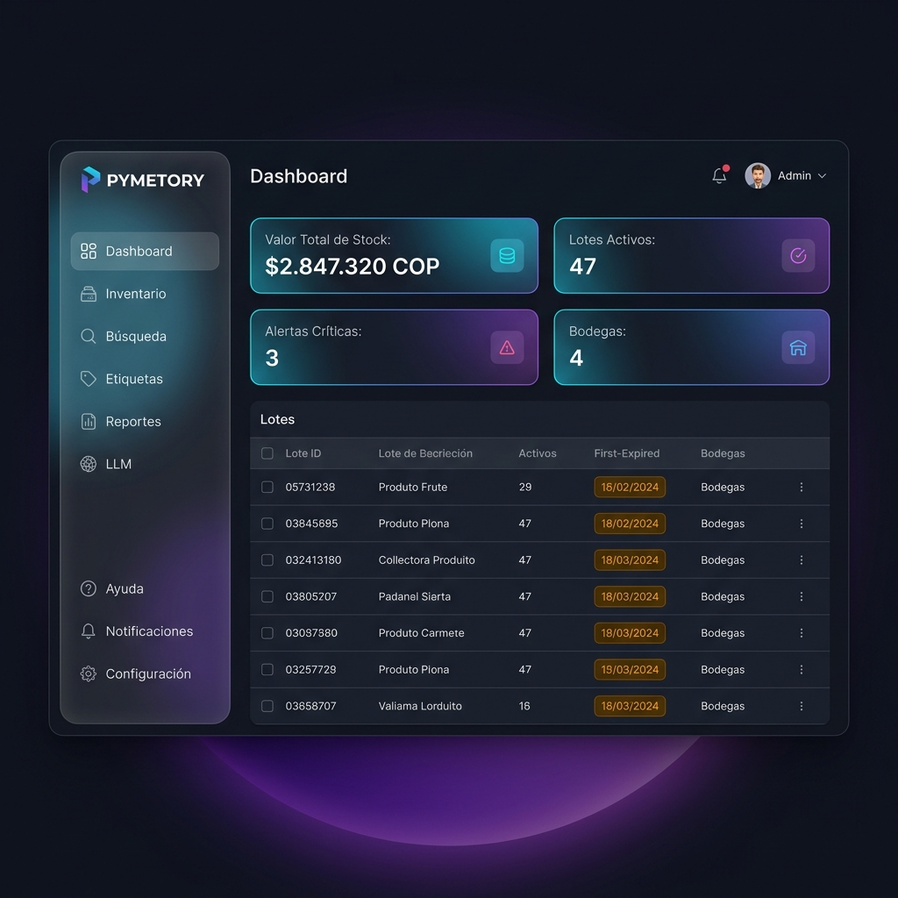
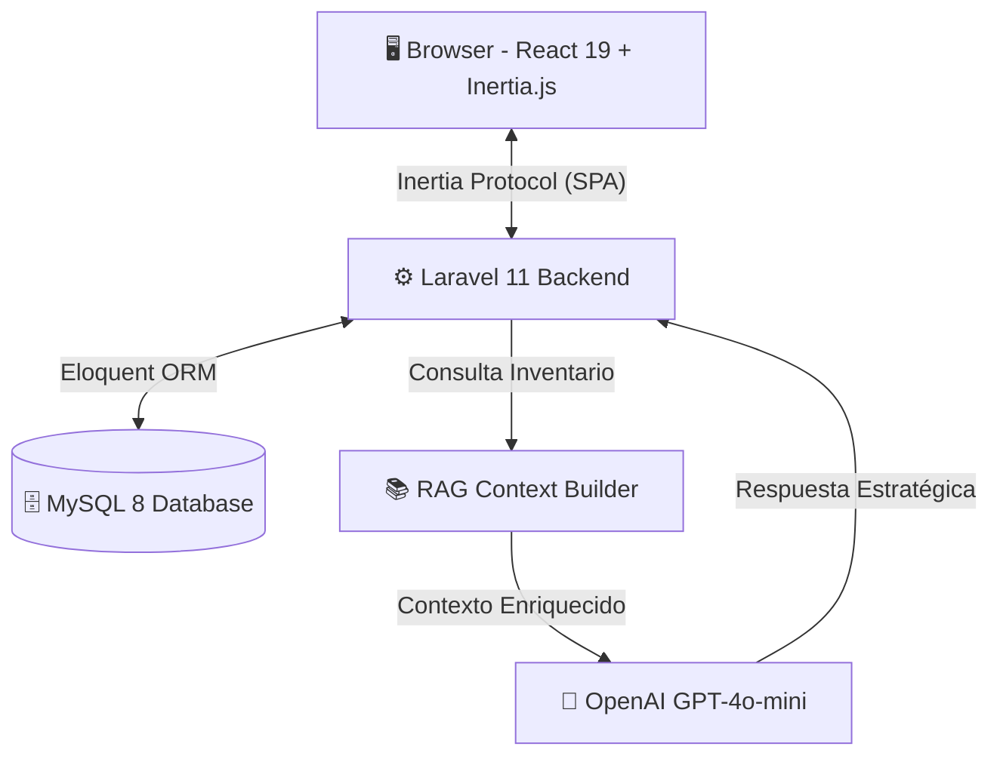
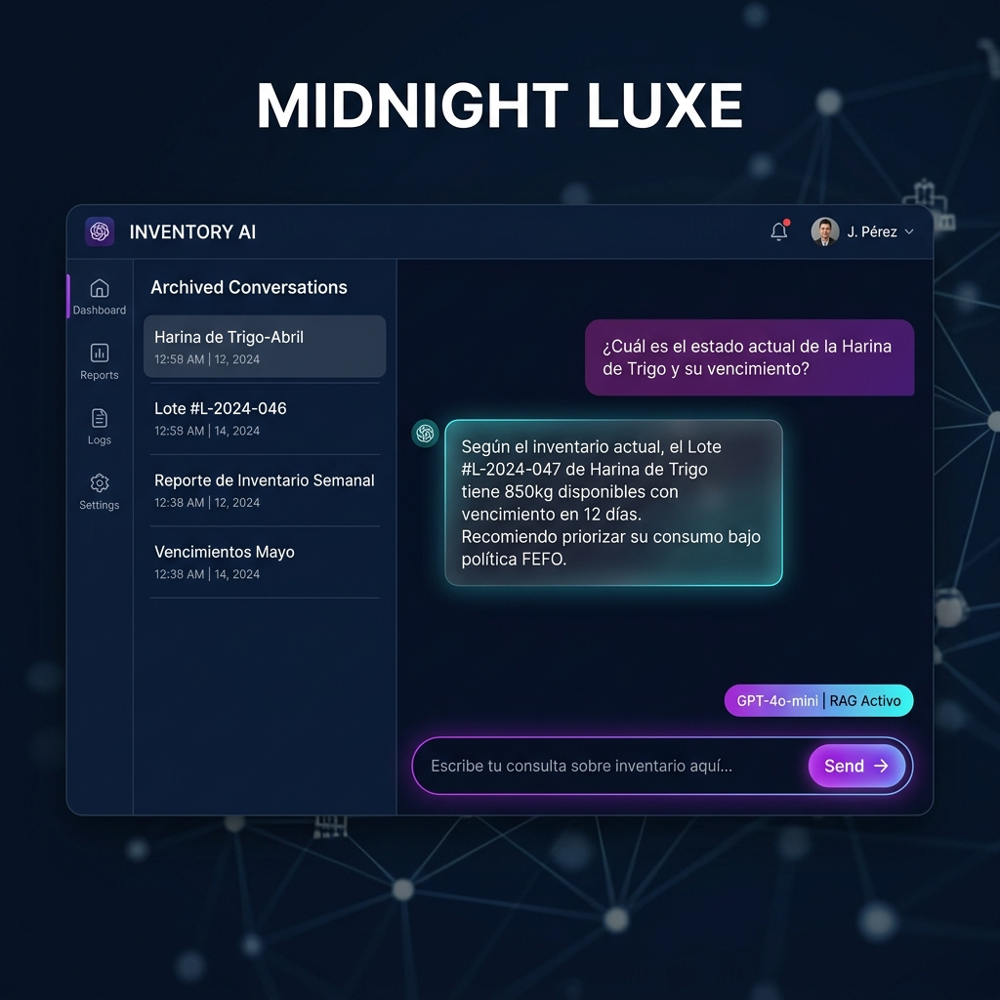
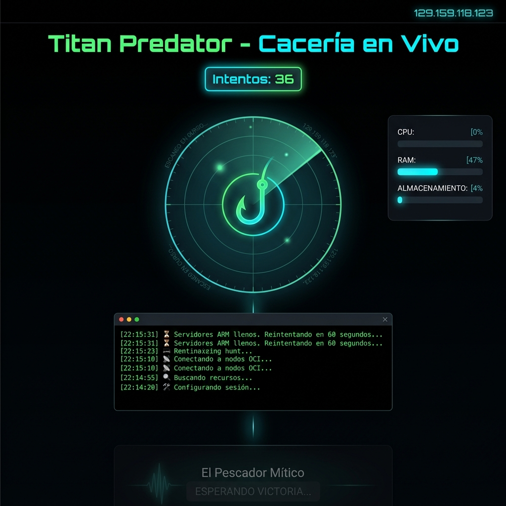

<div align="center">

# 🏭 PYMETORY
### Sistema de Gestión de Inventarios con Inteligencia Artificial para PYMEs

[](https://laravel.com)
[](https://react.dev)
[](https://inertiajs.com)
[](https://tailwindcss.com)
[](https://www.php.net)
[](https://openai.com)

<br/>

> **Proyecto de Grado — Universidad del Valle**
>
> *Germán David Murillas Mondragón · Jorge Augusto Estacio Almeciga*
>
> *Director: Prof. Héctor Fabio Ocampo*

<br/>



</div>

---

## 📋 Tabla de Contenidos

- [¿Qué es PYMETORY?](#-qué-es-pymetory)
- [Módulos del Sistema](#-módulos-del-sistema)
- [Stack Tecnológico](#-stack-tecnológico)
- [Arquitectura](#-arquitectura)
- [Capturas del Sistema](#-capturas-del-sistema)
- [Instalación Local](#-instalación-local)
- [Despliegue en Producción](#-despliegue-en-producción)
- [Operación Titan Predator](#-operación-titan-predator)
- [Casos de Uso](#-casos-de-uso)
- [Estado del Proyecto](#-estado-del-proyecto)
- [Equipo](#-equipo)

---

## 🎯 ¿Qué es PYMETORY?

**PYMETORY** es un sistema web de gestión de inventarios diseñado específicamente para Pequeñas y Medianas Empresas (PYMEs) del sector productivo. Integra un módulo de **Inteligencia Artificial con arquitectura RAG** (Retrieval-Augmented Generation) que permite consultar el estado del inventario mediante lenguaje natural.

### Problema que resuelve

Las PYMEs colombianas gestionan su inventario con hojas de cálculo o software genérico que no entiende el contexto de su negocio. PYMETORY les da:

- ✅ **Trazabilidad completa** — Cada lote tiene un Kardex histórico de todos sus movimientos
- ✅ **Inteligencia FEFO** — El sistema prioriza automáticamente los lotes más próximos a vencer
- ✅ **Consulta en lenguaje natural** — "¿Cuánto azúcar me queda y cuándo vence?" → el LLM lo responde con datos reales
- ✅ **Auditoría para gerencia** — Reportes de valoración de inventario y eficiencia de bodegas

---

## 🧩 Módulos del Sistema

| Módulo | Descripción | Estado |
|--------|-------------|--------|
| 📊 **Tablero** | Dashboard con KPIs en tiempo real (stock, alertas FEFO, valor total) | ✅ Completo |
| 📦 **Inventario** | CRUD de materiales y lotes, vista por bodegas, búsqueda global | ✅ Completo |
| 🤖 **Consulta IA (RAG)** | Chat inteligente que consulta la DB y responde sobre el inventario | ✅ Completo |
| 🏭 **Bodegas** | Gestión de ubicaciones, carpetas dinámicas, capacidad | ✅ Completo |
| ⚖️ **Conciliación** | Ajuste manual de inventario físico vs. lógico (Admin only) | ✅ Completo |
| 🚚 **Consumo/Despacho** | Descuento automático de stock con lógica FEFO | ✅ Completo |
| 📜 **Log Maestro** | Kardex histórico completo con auditoría de todos los movimientos | ✅ Completo |
| 🏷️ **Etiquetas & QR** | Generación de etiquetas con código QR para trazabilidad física | ✅ Completo |
| 📈 **Reportes** | Valoración de inventario, eficiencia de bodegas, métricas FEFO | 🔄 En desarrollo |
| ⚙️ **Configuración** | Panel de control del LLM, notificaciones, seguridad | 🔄 En desarrollo |

---

## 🛠️ Stack Tecnológico

```
┌─────────────────────────────────────────────────────────┐
│                    FRONTEND (React 19)                   │
│         Inertia.js 2.0 · Tailwind CSS v4                │
│              Tema Visual: Midnight Luxe 🌙               │
├─────────────────────────────────────────────────────────┤
│                   BACKEND (Laravel 11)                   │
│            PHP 8.3 · Slim Middleware · RBAC             │
├─────────────────────────────────────────────────────────┤
│                  BASE DE DATOS (MySQL 8)                 │
│     Materiales · Lotes · Bodegas · Movimientos          │
├─────────────────────────────────────────────────────────┤
│              IA / LLM (OpenAI GPT-4o-mini)              │
│         RAG · Contexto de Inventario en Tiempo Real     │
└─────────────────────────────────────────────────────────┘
```

### Diseño — Midnight Luxe Theme

El sistema usa un tema visual premium de nombre **Midnight Luxe**:
- Fondo `#0f1117` — Charcoal profundo
- Glassmorphism en cards y sidebar
- Glows radiales en púrpura y cian
- Tipografía Inter con jerarquía de tensión
- Animaciones suaves con micro-interacciones

---

## 🏗️ Arquitectura



### Seguridad — RBAC

| Rol | Permisos |
|-----|----------|
| **Admin** | Acceso total: reportes, configuración, auditoría, conciliación |
| **Operario** | Registro de movimientos, consultas de stock, despacho |

---

## 📸 Capturas del Sistema

### Dashboard Principal

*KPIs en tiempo real: valor total de stock, lotes activos, alertas FEFO y bodegas*

### Módulo de Consulta Inteligente (RAG/LLM)

*El asistente IA consulta la base de datos real y responde sobre el inventario en español*

### Operación Titan Predator — Monitor en Tiempo Real

*Sistema de cacería automática de la instancia ARM de Oracle Cloud (4 OCPU / 24 GB RAM)*

---

## 🚀 Instalación Local

### Requisitos previos
- PHP 8.3+
- Node.js 20+
- MySQL 8.0+
- Composer 2+

### Pasos

```bash
# 1. Clonar el repositorio
git clone https://github.com/germanmurillas/gestor-inventario-pymes-llm.git
cd gestor-inventario-pymes-llm

# 2. Instalar dependencias PHP
composer install

# 3. Instalar dependencias Node
npm install

# 4. Configurar entorno
cp .env.example .env
php artisan key:generate

# 5. Configurar base de datos en .env
# DB_DATABASE=pymetory
# DB_USERNAME=tu_usuario
# DB_PASSWORD=tu_contraseña
# OPENAI_API_KEY=tu_api_key

# 6. Ejecutar migraciones y seeders
php artisan migrate --seed

# 7. Iniciar servidores de desarrollo
php artisan serve          # Terminal 1 → http://localhost:8000
npm run dev                # Terminal 2 → Vite HMR
```

### Credenciales de acceso (demo)
```
Email:    admin@pymetory.com
Password: Pymetory2026
```

---

## ☁️ Despliegue en Producción

### Infraestructura Actual

| Componente | Detalle |
|-----------|---------|
| **Proveedor** | Oracle Cloud Infrastructure (OCI) |
| **Servidor** | Ubuntu 22.04 LTS |
| **IP Pública** | `129.159.118.123` |
| **Stack** | Nginx + PHP-FPM 8.3 + MySQL 8 |

### Instancia Objetivo (Pending)
Se está cazando automáticamente una instancia **VM.Standard.A1.Flex (4 OCPU / 24 GB RAM)** usando el sistema automatizado **Titan Predator** para ejecutar el modelo LLM de forma local con Ollama.

---

## 🎣 Operación Titan Predator

Sistema de automatización para capturar una instancia ARM de Oracle Cloud Free Tier:

```
hunter.py ──→ OCI API ──→ LaunchInstance (4 OCPU / 24GB RAM)
   ↑                              │
   └──── Retry cada 60s ◄─────── Out of Capacity
                                  │ VICTORIA
                                  ↓
                     Instancia creada + SSH key injected
```

**Monitor en vivo:** `http://129.159.118.123/`

El sistema incluye:
- 🎯 Bot de cacería (`hunter.py`) corriendo 24/7 en Oracle Cloud
- 👁️ Vigía web (`watcher.py`) exponiendo logs en tiempo real
- 🎣 Animación épica "El Pescador Mítico" que se activa al conseguir la instancia
- 📊 Monitor de sistema: CPU, RAM y disco en tiempo real

---

## 📋 Casos de Uso

### UC1 — Consulta RAG de Inventario
```
Operario: "¿Cuánta harina de trigo tenemos disponible?"
   ↓
PYMETORY RAG: Consulta DB → Lote L-047: 850kg, vence en 12 días
   ↓
Respuesta: "Tienes 850kg en Bodega 2. ⚠️ Vence en 12 días. Prioriza su consumo."
```

### UC2 — Despacho Automático FEFO
```
1. Operario solicita 200kg de azúcar
2. Sistema ordena lotes por fecha de vencimiento (FEFO)
3. Descuenta del Lote más próximo a vencer
4. Registra movimiento en Kardex histórico
5. Actualiza stock disponible en tiempo real
```

### UC3 — Conciliación de Inventario (Admin)
```
1. Conteo físico detecta diferencia: 50kg de más en Bodega 3
2. Admin abre módulo de Conciliación
3. Registra ajuste con justificación
4. Sistema genera movimiento de tipo AJUSTE en el Kardex
5. Log Maestro queda con registro auditado del ajuste
```

---

## 📊 Estado del Proyecto

### Cronograma Universidad del Valle

```
Sem 1-8   ████████████████ Requisitos y Mockups (Figma)     ✅
Sem 9-11  ████████████     Backend Laravel + MySQL           ✅
Sem 12    ████████         RAG/LLM + Frontend React 19       ✅
Sem 13-14 ████             Pruebas + Reportes               🔄
Sem 15    ██               Sustentación Final               ⏳
```

### Kanban Actual

Ver [KANBAN.md](KANBAN.md) para el tablero completo de tareas.

---

## 👥 Equipo

<table>
  <tr>
    <td align="center">
      <b>Germán David Murillas Mondragón</b><br/>
      <sub>Desarrollador Principal · Ing. Sistemas en Formación</sub><br/>
      <sub>Universidad del Valle</sub>
    </td>
    <td align="center">
      <b>Jorge Augusto Estacio Almeciga</b><br/>
      <sub>Arquitecto & Socio Estratégico · Ing. Sistemas en Formación</sub><br/>
      <sub>Universidad del Valle</sub>
    </td>
  </tr>
</table>

**Director de Proyecto:** Prof. Héctor Fabio Ocampo — Universidad del Valle

---

<div align="center">

**PYMETORY** — *Inventario Inteligente para la PYME Colombiana*

`Laravel 11` · `React 19` · `Inertia.js 2.0` · `GPT-4o-mini RAG` · `Midnight Luxe`

Universidad del Valle · 2026

</div>
