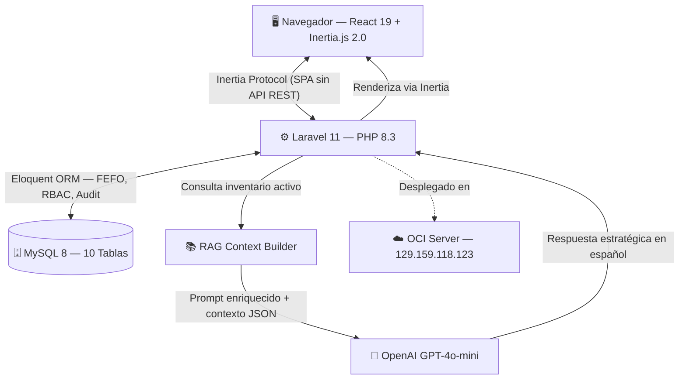

# Arquitectura del Sistema — PYMETORY
> Última actualización: 30 de Abril de 2026

El sistema PYMETORY está construido bajo un enfoque **ABD (Arquitectura Basada en Dominio)**, utilizando un stack moderno que prioriza la velocidad de respuesta, la trazabilidad de datos y la integración de inteligencia artificial aplicada a la gestión de inventarios.

---

## Diagrama de Componentes



---

## Stack Tecnológico

| Capa | Tecnología | Versión | Rol |
|------|-----------|---------|-----|
| **Frontend** | React | 19 | Componentes funcionales + Hooks |
| **Bridge** | Inertia.js | 2.0 | SPA sin API REST — data server-side |
| **Backend** | Laravel | 11 | Framework PHP slim con middleware propio |
| **Runtime** | PHP | 8.3 | Named arguments, Fibers, readonly props |
| **Base de Datos** | MySQL | 8.0 | 10 tablas, índices FEFO, JSON columns |
| **Estilos** | Tailwind CSS | v4 | Utility-first + Midnight Luxe theme |
| **IA / LLM** | OpenAI | GPT-4o-mini | Modelo de producción por costo/rendimiento |
| **PDF** | DomPDF | 2.x | Exportación de reportes de inventario |
| **QR** | react-qr-code | latest | Generación de etiquetas con trazabilidad |

---

## Patrón Arquitectural: ABD + MVC

```
┌─────────────────────────────────────────────────┐
│                  FRONTEND                        │
│  React 19 Components (Figma* naming convention) │
│  FigmaTablero · FigmaSearch · FigmaLogMaestro   │
│  FigmaReports · FigmaSettings · FigmaLabels     │
│  FigmaForms · FigmaConsumeForm · FigmaChatLLM  │
└────────────────────┬────────────────────────────┘
                     │ Inertia.js (props via PHP)
┌────────────────────▼────────────────────────────┐
│                  BACKEND (Laravel 11)            │
│  Controllers: Inventory · Settings · ChatLLM    │
│               Auth · Consumption                │
│  Models: Material · Lote · Bodega · Movimiento  │
│          Tag · Notification · Setting · AuditLog│
│  Middleware: CheckRole (RBAC admin/operario)    │
└────────────────────┬────────────────────────────┘
                     │ Eloquent ORM
┌────────────────────▼────────────────────────────┐
│                  BASE DE DATOS                   │
│  users · bodegas · materials · lotes            │
│  movimientos · tags · material_tag              │
│  notifications · settings · audit_log           │
└─────────────────────────────────────────────────┘
```

---

## Módulo RAG — Inteligencia Artificial

La diferencia con un chatbot genérico: el sistema **inyecta el estado real del inventario** en cada prompt.

```
Usuario pregunta: "¿Cuánta harina queda?"
         │
         ▼
ChatLLMController::ask()
         │
         ├─► Consulta DB: Lote::activos()->with('material')->take(20)
         │   → [ {material: "Harina de Trigo", cantidad: 850, bodega: "Central", vence: "2024-11-12"}, ... ]
         │
         ├─► Construye prompt:
         │   "Eres un asistente de inventario. El estado actual es:
         │    [JSON de lotes activos]. Responde: ¿Cuánta harina queda?"
         │
         └─► OpenAI API → Respuesta fundamentada en datos reales
```

**Parámetros configurables** (vía tabla `settings`):
- `llm_modelo`: `gpt-4o-mini` | `gpt-4o` | `claude-3-haiku`
- `llm_temperatura`: 0.0 – 1.0
- `llm_max_tokens`: 256 – 4096
- `llm_contexto_lotes`: N lotes a inyectar (default: 20)

---

## Lógica FEFO (First-Expired, First-Out)

```php
// Scope en Lote model — activos ordenados por vencimiento más próximo
Lote::activos()->orderBy('expiration_date', 'asc')

// Alerta crítica: vence en ≤ 15 días
Lote::activos()->venceEn(15)->count() → lotesCriticos

// Valorización total del inventario
SUM(quantity × unit_cost) → totalInventoryValue (COP)
```

---

## Seguridad — RBAC (Role-Based Access Control)

```php
// Middleware CheckRole — registrado en bootstrap/app.php
Route::middleware(['auth', 'role:admin'])->group(function () {
    // Conciliación, Reportes PDF, Configuración, Bodegas
});
```

| Rol | Módulos accesibles |
|-----|--------------------|
| **Admin** | Todo: reportes, conciliación, settings, audit log, bodegas |
| **Operario** | Dashboard, inventario (lectura), registro de consumos, búsqueda, IA, labels QR |

---

## Estrategia de Despliegue

### Servidor Actual — OCI (Oracle Cloud Infrastructure)
```
Ubuntu 22.04 LTS
Nginx 1.24 (proxy + SSL)
PHP-FPM 8.3
MySQL 8.0
IP Pública: 129.159.118.123
SSH: Puerto 443 (evasión de bloqueo ISP)
```

### Objetivo — Instancia ARM (Pendiente)
```
VM.Standard.A1.Flex: 4 OCPU / 24 GB RAM
Objetivo: Ejecutar modelo LLM local (Ollama + Llama3)
Estado: Cazando con hunter.py (Out of Capacity)
```

---

## Convenciones del Código

### Naming Convention Frontend
Todos los componentes principales siguen el prefijo `Figma*` para identificar el módulo de pantalla:
- `FigmaTablero` — Dashboard y KPIs
- `FigmaLogMaestro` — Kardex histórico  
- `FigmaSearch` — Buscador con filtros
- `FigmaReports` — Analítica y PDF
- `FigmaSettings` — Configuración
- `FigmaLabels` — Etiquetas QR
- `FigmaForms` — Formularios de alta
- `FigmaConsumeForm` — Despacho FEFO

### Commits — Conventional Commits
```
feat(módulo): descripción
fix: descripción
docs: descripción
chore: descripción
refactor: descripción
```
