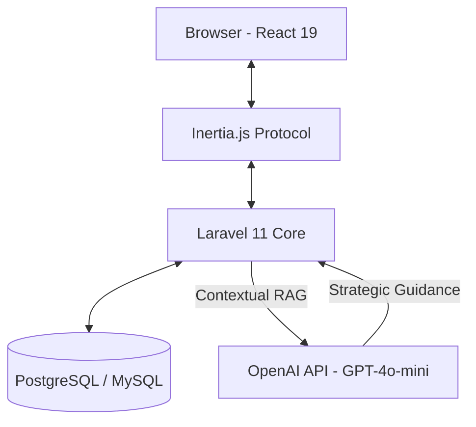

# Arquitectura del Sistema - PYMETORY

El sistema PYMETORY está construido bajo un enfoque de **Desarrollo Basado en Agentes (ABD)**, utilizando un stack moderno que prioriza la velocidad de respuesta y la precisión en el manejo de datos críticos.

## Diagrama de Componentes

## Stack Tecnológico Académico

1.  **Framework Backend:** Laravel 11. Aprovecha las nuevas `Slim Migrations` y el manejo de middleware simplificado en `bootstrap/app.php`.
2.  **Motor Frontend:** React 19. Utiliza componentes funcionales y Hooks para una interfaz reactiva sin latencia percibida.
3.  **Puente de Datos:** Inertia.js 2.0. Elimina la necesidad de una API REST tradicional, permitiendo una experiencia de SPA (Single Page Application) con la seguridad del renderizado en servidor.
4.  **Diseño Visual:** Tailwind CSS v4 + Midnight Luxe Theme. Enfoque brutalista y moderno para una visualización clara en entornos industriales.
5.  **Cerebro IA:** Módulo RAG (Retrieval-Augmented Generation). No es una implementación de chat genérico; el sistema inyecta el estado actual del inventario (Kardex y FEFO) en el contexto de la IA para obtener respuestas precisas sobre el negocio.

## Estrategia de Seguridad (RBAC)

El sistema implementa un Control de Acceso Basado en Roles (RBAC) mediante el middleware `CheckRole`.
- **Admin:** Acceso total a reportes, configuraciones y auditoría.
- **Operario:** Acceso limitado a registro de movimientos y consultas de stock.
