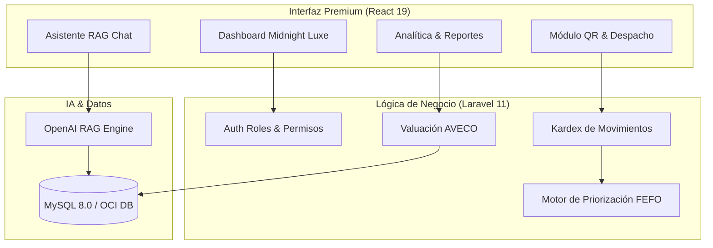

# 🏛️ Visión Final del Sistema - PYMETORY

Este documento representa la arquitectura y el flujo final de PYMETORY una vez integrados todos los módulos de la tesis.

## Arquitectura de Módulos (Core)

## Flujo Crítico de Usuario (Escenario Tesis)

1.  **Ingreso Inteligente:** El operario registra un lote. El sistema autocompleta unidades y sugiere bodega según capacidad.
2.  **Etiquetado Automático:** Se genera un QR único para pegarlo físicamente en el material.
3.  **Monitoreo RAG:** El Gerente pregunta: *"¿Cuál es mi rentabilidad actual retenida en stock?"*. La IA consulta el `unit_cost` y responde con la valoración AVECO.
4.  **Alerta FEFO:** El sistema envía una notificación `CRITICAL` cuando un material de alto costo está a 7 días de vencer.
5.  **Despacho Ágil:** Escaneo de QR -> Formulario de Consumo -> Actualización automática de Kardex.

## Roadmap de Implementación Final
*   [x] Core Dashboard & Auth.
*   [x] Conexión Real de Datos.
*   [x] Módulo de Conciliación Física.
*   [ ] **Módulo de Analítica FEFO (Siguiente paso).**
*   [ ] **Generador de Etiquetas Dinámicas.**
*   [ ] **Refinamiento de Contexto LLM.**

---
> No es solo un gestor de inventarios; es un consultor basado en datos e inteligencia artificial.
