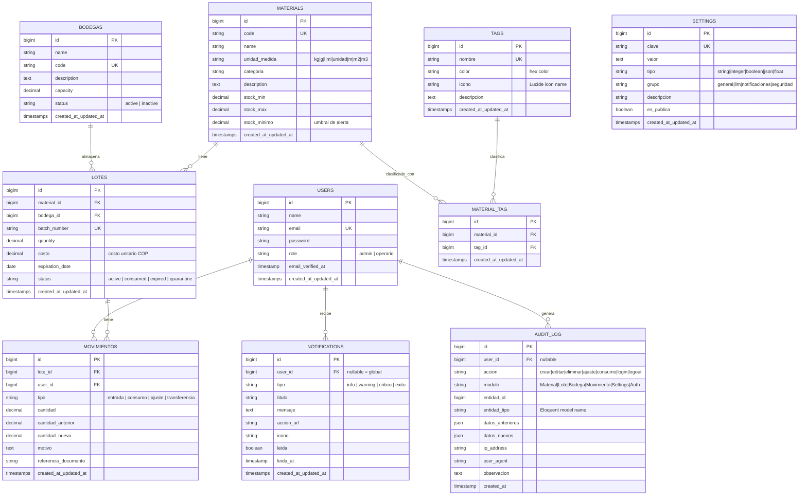

# 📐 Modelo Entidad-Relación — PYMETORY
> Última actualización: 29 de Abril de 2026

## Diagrama MER Completo

---

## Descripción de Tablas

### `users` — Usuarios del sistema
Gestiona la autenticación y control de acceso. El campo `role` implementa el RBAC del sistema.

### `bodegas` — Ubicaciones de almacenamiento
Representa las bodegas físicas donde se guardan los lotes. Cada bodega tiene una capacidad máxima y un estado.

### `materials` — Materiales del catálogo
Catálogo maestro de materiales. Un material puede estar en múltiples bodegas a través de sus lotes. Los campos `stock_min`, `stock_max` y `stock_minimo` permiten controlar alertas de nivel de inventario.

### `lotes` — Lotes de inventario
**Entidad central del sistema.** Cada lote representa una unidad de material con una cantidad específica, costo unitario, fecha de vencimiento y estado. La lógica FEFO opera sobre esta tabla.

### `movimientos` — Kardex de movimientos
Registro inmutable de todos los cambios de inventario. Cada movimiento guarda el estado anterior y nuevo de la cantidad. Esta es la fuente de verdad del Kardex histórico.

### `tags` — Etiquetas de clasificación
Categorías personalizables para los materiales (Químico, Sólido, Perecedero, etc.). Relación many-to-many con materials a través de `material_tag`.

### `material_tag` — Tabla pivot
Pivot para la relación muchos-a-muchos entre materials y tags.

### `notifications` — Notificaciones del sistema
Alertas generadas por el sistema (FEFO crítico, stock bajo, etc.). `user_id = NULL` indica notificación global para todos los usuarios.

### `settings` — Configuraciones persistentes
Almacén de configuraciones del sistema organizadas por grupos. Permite que el administrador modifique parámetros del LLM, notificaciones y seguridad sin tocar el código.

### `audit_log` — Log de auditoría
Registro completo de todas las acciones de usuarios sobre entidades del sistema. Los campos `datos_anteriores` y `datos_nuevos` permiten reconstruir el estado en cualquier punto del tiempo.

---

## Índices de Rendimiento

| Tabla | Índice | Propósito |
|-------|--------|-----------|
| `lotes` | `(material_id, status)` | Búsqueda rápida de lotes activos por material |
| `lotes` | `(expiration_date, status)` | Algoritmo FEFO — lotes ordenados por vencimiento |
| `movimientos` | `(lote_id, created_at)` | Kardex histórico de un lote específico |
| `audit_log` | `(modulo, entidad_id)` | Auditoría de una entidad específica |
| `audit_log` | `(user_id, created_at)` | Acciones de un usuario en el tiempo |
| `notifications` | `(user_id, leida)` | Notificaciones no leídas de un usuario |
| `settings` | `(grupo)` | Configuraciones por grupo (LLM, seguridad, etc.) |
