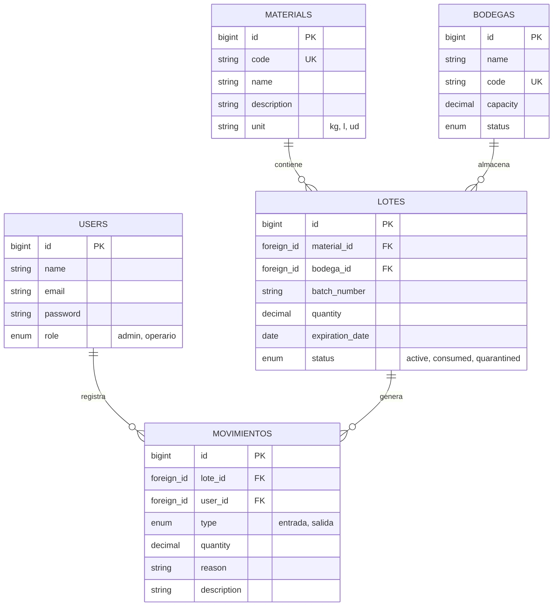

# Modelo Entidad-Relación (MER) - PYMETORY

El siguiente diagrama detalla la estructura relacional de la base de datos, optimizada para la trazabilidad FEFO y gestión de múltiples ubicaciones físicas.

## Descripción de Entidades Clave

- **MATERIALS:** Maestro de insumos. Define la unidad de medida base.
- **BODEGAS:** Representación física de espacios (frío, seco, etc.) con control de capacidad.
- **LOTES:** La unidad atómica de inventario. Lleva la fecha de vencimiento crucial para la lógica FEFO.
- **MOVIMIENTOS:** El Kardex del sistema. Cada cambio de stock queda registrado por un usuario para auditoría completa.
